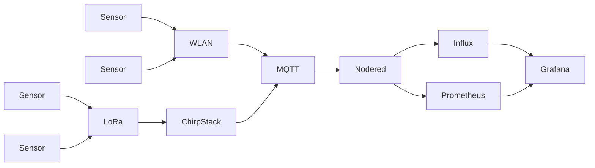

# CAS-IoT-2024

## Architekurübersicht


## ChirpStack Doku

### Initiale Einrichtung
1. Herunterladen des ChirpStack Servers und des MQTT Servers entsprechend der [Dokumentation von ChirpStack](https://www.chirpstack.io/docs/getting-started/docker.html) per git.
2. Starten des ChirpStack Servers und des MQTT Brokers mit docker compose, entsprechend der [Dokumentation](https://github.com/chirpstack/chirpstack-docker)
3. Die Konfiguration von ChirpStack wie folgt anpassen:
```
[integration]
  enabled=["mqtt"]

  [integration.mqtt]
    server="tcp://$MQTT_BROKER_HOST:1883/"
    username="generaluser"
    password=""
    json=true
```

### Gateway Anbinden 
* Mit dem WiFi des Gateways verbinden 
* Im Gateway die `global_conf.json` anpassen 
* ChirpStack Adresse (141.72.13.25) eintragen mit Up and Down Port 1700 
* In ChirpStack das Gateway hinzufügen mit der EUI
* In einer Application neue Devices mit ihren EUI anlegen 

## Sensoren
Alle Sensoren senden die Daten inklusive Metadaten im JSON Dateiformat. Hierbei werden folgende Sensordaten verwendet:
* Temperature   (key: t)
* Humidty       (key: h)
* Sound	        (key: s)
* Lightbarrier  (key: l)

Erwartetes Packet:

Tbd.

## NodeRed
NodeRed ist das Anwendungsystem. Mit NodeRed wird ein Preprocessing durchgeführt, bevor Daten in die Datenbank eingespeist werden.
Weiterhin können über NodeRed komplizer
### Betrieb
Für den Betrieb wurde Docker (docker-compose) gewählt. Um die Installation von entsprechenden Erweiterungen für Influxdb und Prometheus zu gewährleisten, wurde ein eigens Dockerfile angelegt und das Image gebaut.
Die Daten werden persistent über Volumes gespeichert.

### Anbindung von Sensoren
Die Kommunikation erfolgt grundsätzlich über MQTT (mq.jreichwald.de:1887). 
 
